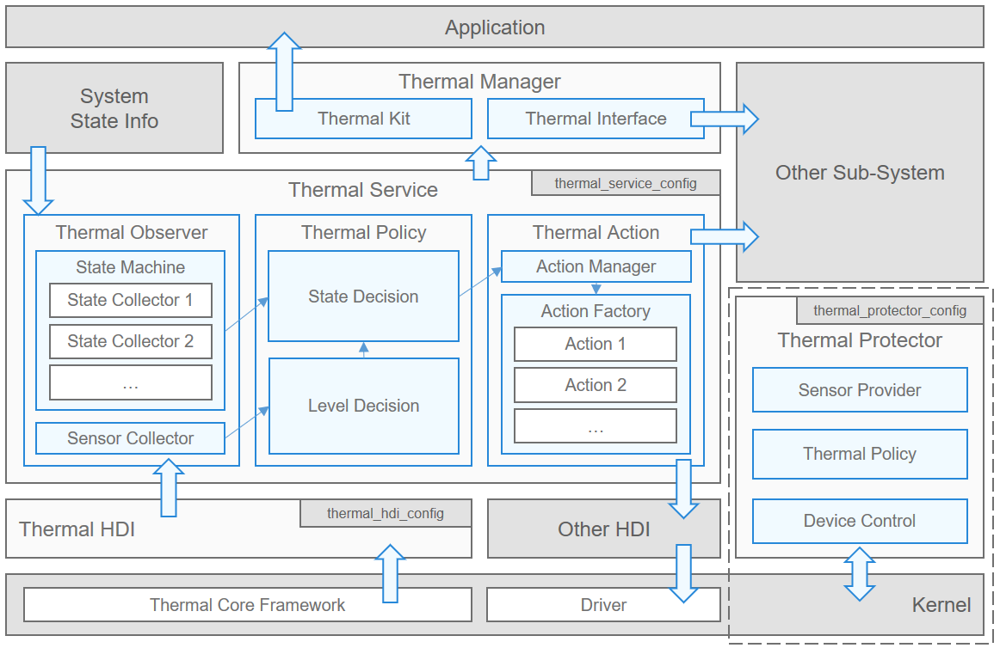

# Thermal Manager

-   [Introduction](#section0056945901)
-   [Directory Structure](#section0056945902)
-   [Configuration Description](#section0056945903)
-   [Repositories Involved](#section0056945904)

## Introduction<a name="section0056945901"></a>

The thermal manager provides the device temperature management and control capabilities to ensure the thermal safety and experience of the entire system.

**Figure 1**  Architecture of the thermal manager


**Key components of the thermal manager**:

1. Thermal Manager: provides temperature query and callback APIs for applications and other subsystems.
2. Thermal Service: implements core temperature control functions, such as temperature detection, temperature level arbitration, and action delivery, according to the configuration file.
3. Thermal HDI: implements temperature driver information reporting and driver instruction delivery according to the configuration file.
4. Thermal Protector: implements simplified temperature control in the non-running state according to the configuration file.

## Directory Structure<a name="section0056945902"></a>
```
/base/powermgr/thermal_manager
├── application                  # Native application
│   └── protector                # Thermal Protector code
├── etc                          # Init configuration
├── figures                      # Architecture diagram
├── frameworks                   # Architecture layer
│   ├── dialog                   # Dialog
│   ├── napi                     # NAPI layer
│   └── native                   # Native layer
├── interface                    # APIs
│   ├── innerkits                # Internal APIs
│   └── kits                     # External APIs
├── sa_profile                   # SA profile
├── services                     # Thermal Service code
│   ├── native                   # Native APIs
│   └── zidl                     # Zidl APIs
├── test                         # Test code
│   ├── fuzztest                 # Fuzz test
│   └── systemtest               # Systemtest
└── utils                        # Utilities
```

## Configuration Description<a name="section0056945903"></a>
**1. thermal\_service\_config.xml**
Configuration example:

```
<?xml version="1.0" encoding="UTF-8"?>
<thermal version="0.99" product="ipx">
    <base>
        <item tag="temperature_query_enum" value="soc,battery,shell,ambient"/>
    </base>
    <level>
        <sensor_cluster name="warm_base" sensor="shell">
            <item level="1" threshold="35000" threshold_clr="33000"/>
            <item level="2" threshold="37000" threshold_clr="35000"/>
            <item level="3" threshold="40000" threshold_clr="38000"/>
        </sensor_cluster>
        <sensor_cluster name="warm_safe" sensor="battery,pa">
            <item level="1" threshold="48000,60000" threshold_clr="45000,55000"/>
        </sensor_cluster>
    </level>
    <state>
        <item name="screen"/>
        <item name="charge"/>
    </state>
    <action>
        <item name="cpu"/>
        <item name="current"/>
        <item name="shut_down" param="100"/>
        <item name="thermal_level" strict="1"/>
    </action>
    <policy>
        <config name="warm_base" level="1">
            <cpu screen="1">2800000</cpu>
            <cpu screen="0">2400000</cpu>
            <current charge="1">1500</current>
            <thermal_level>3</thermal_level>
        </config>
        <config name="warm_base" level="2">
            <cpu screen="1">2200000</cpu>
            <cpu screen="0">1800000</cpu>
            <current charge="1">1200</current>
            <thermal_level>4</thermal_level>
        </config>
        <config name="warm_base" level="3">
            <cpu screen="1">1600000</cpu>
            <cpu screen="0">1200000</cpu>
            <current charge="1">1000</current>
            <thermal_level>5</thermal_level>
        </config>
        <config name="warm_safe" level="1">
            <shut_down>1</shut_down>
        </config>
    </policy>
</thermal>
```
```
thermal                          # Root directory. Wherein, version indicates the version number, and product indicates the product name.
├── base                         # base directory, used to configure basic parameters.
│   └── item                     # item directory. Wherein, tag indicates the configuration tag, and value indicates the configuration value.
├── level                        # Level directory, used to store the temperature level information.
│   └── sensor_cluster           # sensor_cluster directory, used to configure a cluster of sensors. Wherein, name indicates the cluster name, and sensor indicates the sensor name.
│       └── item                 # item directory, used to configure the temperature level information. Wherein, level indicates the temperature level, threshold indicates the triggering temperature, and xxx_clr indicates the setback temperature.
├── state                        # state directory, used to configure the state machine. Wherein, name indicates the name of the state machine.
├── action                       # action directory, used to configure actions. Wherein, name indicates the name of the action, param indicates the action parameter, and strict indicates the arbitration scheme.
└── policy                       # policy directory, used to configure the policy for the corresponding temperature level.
    └── config                   # config directory, used to configure the action for the corresponding temperature level. Wherein, name is that of sensor_cluster, and the level is that of the item in sensor_cluster.
        └── <action_name>        # action name corresponding to the action value. The state condition and its value can be configured in this attribute.
```


## Repositories Involved<a name="section0056945904"></a>
[Power Management Subsystem](https://gitee.com/openharmony/docs/blob/master/en/readme/power-management.md)

[powermgr_power_manager](https://gitee.com/openharmony/powermgr_power_manager)

[powermgr_display_manager](https://gitee.com/openharmony/powermgr_display_manager)

[powermgr_battery_manager](https://gitee.com/openharmony/powermgr_battery_manager)

**powermgr_thermal_manager**

[powermgr_battery_statistics](https://gitee.com/openharmony/powermgr_battery_statistics)

[powermgr_battery_lite](https://gitee.com/openharmony/powermgr_battery_lite)

[powermgr_powermgr_lite](https://gitee.com/openharmony/powermgr_powermgr_lite)
